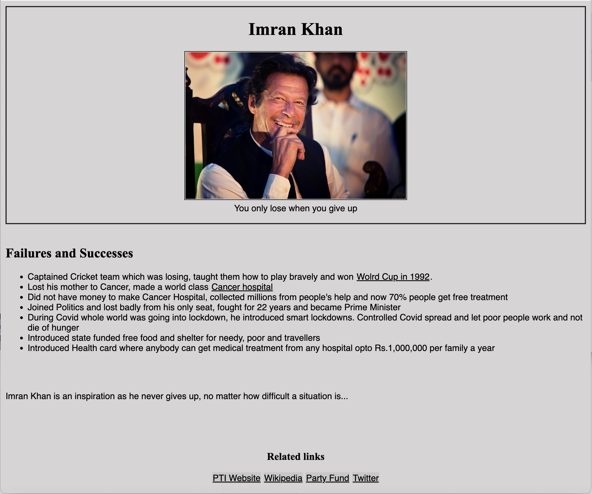

# Project

A website made as capstone project during my bootcamp with Hyperion-Dev, using HTML and CSS.

## Inspirational Personality

A project about my inpirational figure of current times.

## Table of contents

- [Introduction](#introduction)
- [Installation](#installation)
- [What I Learned](#whatilearned)
- [How It Looks](#howitlooks)
- [Credits](#credits)

[Introduction](#introduction)
A website made as capstone project during my bootcamp with Hyperion-Dev, using HTML and CSS. I needed to make a tribute page and then turn it into capstone project.

[Installation](#installation)

- Tap on the button in top right of this project saying 'Code' and download zip folder to your desired directory.
- Unzip the folder
- Or you can clone repository by writing $ git clone [https://github.com/sanSha2/finalCapstone.git](https://github.com/sanSha2/finalCapstone.git).
- Open the folder where you downloaded/cloned the project and click `index.html`
- Your default broswer will open, and the page will be displayed.

[What I Learned](#whatilearned)

Created a multipage website using HTML and CSS.

- Included different HTML tags, applied styling using tag names, class and ids.
- Displayed various font sizes.
- Embedded and enabled Navigation to external links.
- Displayed images.
- Displayed table, ordered and unordered list, radio button and submit button.

[How It Looks](#howitlooks)
For your ease I have provided screenshots of the website.

[Credits](#credits)
This Game is made by me [SanSha](https://github.com/sanSha2)
x
